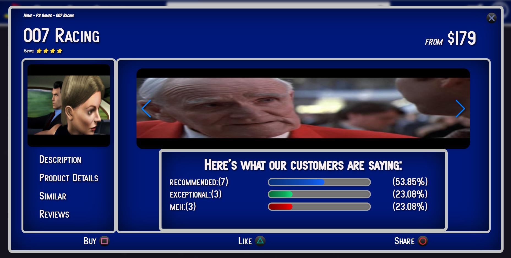

<h1 style="font-weight: 900"> Retro Cult Games - https://tim-broderick.com/RetroCult/ </h1>

This is a fun mock eshop that was designed to refine my skills in React. It was a really engaging project that strogly assisted in developing my React skills. The store is specifically for geeks who love old Playstation 1 (PSX) games. 

<h1 style="font-weight: 900"> Screenshots </h1>

## 1. Welome to Retro Cult Games

## 2. Search for your Favourite PSX Games!

## 3. Functional Filters to refine your Search Results 

## 4. Lots of Useful Stats and Information

## 4. Imagine Being Able to Buy All Your Favourite PSX Games!

## What did I use to create it?

This project uses:

-   React
-   HTML
-   SCSS
-   Firebase
-   RAWG API (Video Game Database)

## Features of the Project:

-  Users are able to search for their favourite PSX games and with a variety of filters ('title', 'author', 'category', etc.)
- When users click on a title, they are able to get a more detailed overview of the game.
-  Recommendations are made on the users choices. 
-  Details are provided on the game. 
-  Reviews posted by users of the RAWG Api give users a balanced community review of the game.
-  Users are able to choose the condition of their game. (If there are none in stock or they are about to purchase the last one, there are custom messages)
-  A cart page lists all their pending purchases and allows for items to be removed.

<h1 style="font-weight: 900"> Here are some of the lessons I learnt:</h1>

### Using React:

### Growing More Comfortable with React:

-  This project helped solidify my understandings of React. I was able to more confidently and comfortably use React. I enjoyed being able to recycle components from previous projects and creating my own (very simple) custom hook. I feel more 'fluid' in being able to work with React now.

### Routing:

- This was the first project I used routing and it was challenging at first but as I looked more into it, the more comfortable I became with it. Being able to start anywhere from in the app is understandable, good UI.
  
### More Than Meets the Eye:

- At first glance, it didn't seem like much but there is a lot that goes into the construction of an eshop (even a fake one like this). The most important lesson I learnt was first making sure that you meet the requirements of the MVP (i.e You've met the specs and have a functional product)...And then, you can try to be fancy and implement new technologies or ideas. Time isn't always on your side. 

## What I want to include in the future:

## Have more functionality:

-   [ ] Allow users to create lists of games (wishlists &/or lists for their own collections)
-   [ ] Improve upon my database so that it includes all the data I need (rather than 'borrowing' data from other APIs, etc.)
-   [ ] Implement Stripe (or some other mock payment system)
-   [ ] Small bug fixes / asthetic changes
-   [ ] Allow users to share &/or like their favourite games
-   [ ] Include a members area
-   [ ] General UI improvements (e.g. empty cart = make some suggestions, etc.)

## Thank You!

Thank you for taking the time to look at this project. I really hope you enjoy it.
Feel free to reach out and ask any questions.

[Tim Broderick]
